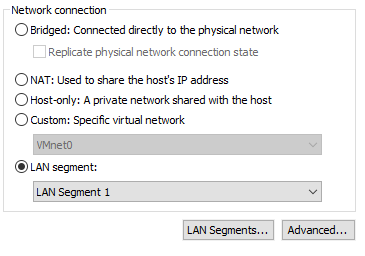
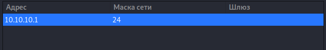
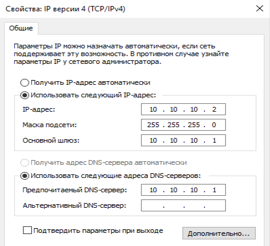
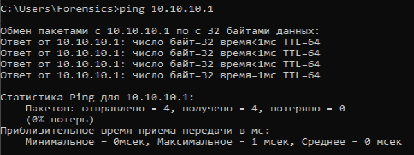
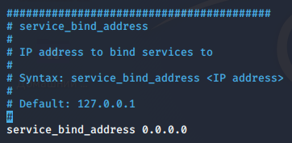
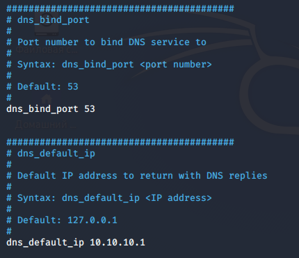
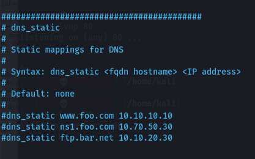
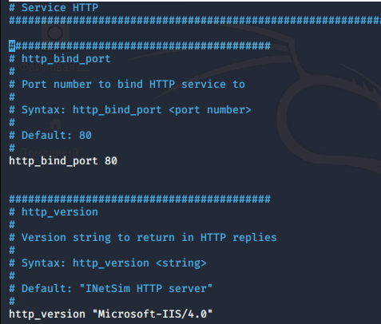
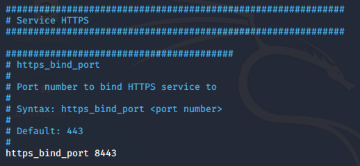
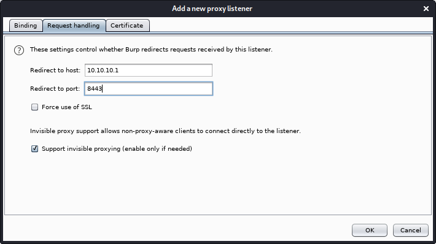

# Создание виртуальной криминалистической лаборатории для анализа ВПО

[Ссылка 1](https://example.com)

[Ссылка 2](https://example.com)

[Ссылка 3](https://example.com)

_При расследовании киберинцидентов часто приходится вскрывать вредоносные программы, изучать их взаимодействие с сетью и файловой системой. Результатом исследования обычно становятся сигнатуры вредоноса и индикаторы компрометации (IOCs), а сам анализ проводится в изолированной среде при помощи специального инструментария. О том, как устроена такая лаборатория, мы сегодня и поговорим._

---

Многие вредоносы взаимодействуют с управляющим сервером, используя протокол HTTPS, который шифрует передаваемые данные. Поэтому в сетевом трафике нельзя обнаружить команды взаимодействия и отправляемую информацию. Когда под рукой нет автоматизированной песочницы, но необходимо проанализировать HTTP- и HTTPS-запросы, вызовы DNS и многое другое, можно собрать подходящий стенд самостоятельно.

**Не рекомендуется исследовать вредоносные программы на рабочей операционной системе, поскольку это может привести к заражению машины и утере ценных данных.**

## Необходимое ПО

Для организации исследовательской лаборатории можно использовать разный софт, джентельменский набор выглядит следующим образом:

1. VMware Workstation Pro — это гипервизор для настольных компьютеров, отраслевой стандарт для работы с виртуальными машинами.
2. Kali Linux или любая другая операционная система на базе ядра Linux. Я использую Kali, так как в ней по умолчанию установлены необходимые инструменты.
3. Windows 10 или другая актуальная версия Windows. Наибольшее количество вредоносных файлов разработано под Windows, поэтому анализировать их лучше именно в этой операционной системе.
4. Inetsim — программный продукт, предназначенный для моделирования интернет‑сервисов в лабораторных условиях, например для анализа сетевого поведения неизвестных образцов вредоносных программ.
5. FLARE VM — полностью настраиваемый набор инструментов на базе Windows для анализа вредоносных программ, реагирования на инциденты, тестирования на проникновение и так далее.
6. Burp Suite используется в качестве прозрачного прокси‑сервера с целью анализа взаимодействия вредоносного файла по протоколу HTTPS.
7. IDA Pro — интерактивный дизассемблер, используемый для реверс‑инжиниринга. Одно из преимуществ IDA — встроенный плагин Hex Rays, а также поддержка отладки удаленных приложений, которая необходима при анализе вредоносных файлов под Linux.

## Создание лаборатории

Наша лаборатория будет работать на двух виртуальных машинах c IP-адресами 10.10.10.1 (Kali Linux с установленным Inetsim) и 10.10.10.2 (Windows 10 с установленным программным обеспечением для реверс‑инжиниринга), находящихся в изолированной сети. На виртуальной машине Kali Linux будут работать различные интернет‑службы, а на виртуальной машине Windows мы будем исследовать вредоносные программы.

## Схема сети

Собирать лабораторию будем в шесть этапов:
1. Установка VMware Workstation Pro, создание виртуальной машины из образа Kali Linux и Windows.
2. Установка необходимого ПО на виртуальную машину Kali Linux.
3. Установка необходимого ПО на виртуальную машину Windows 10.
4. Настройка изолированной виртуальной сети.
5. Настройка ПО Inetsim.
6. Тестирование работоспособности нашей лаборатории.

## Установка INETSIM
По умолчанию в Kali Linux уже установлен Inetsim, но, если ты используешь другую операционную систему на базе ядра Linux, процесс установки очень прост и описан в документации. Достаточно прочитать инструкцию для загрузки пакета Inetsim при помощи утилиты apt либо dpkg.

## Установка необходимого ПО на виртуалку Windows
1. Загружаем файлы из репозитория flare-vm: `git clone https://github.com/mandiant/flare-vm.git`.
2. Открываем PowerShell от имени администратора.
3. Разблокируем установочный файл, выполнив команду `Unblock-File .\install.ps1`.
4. Включаем выполнение скрипта с помощью команды `Set-ExecutionPolicy Unrestricted`.
5. Выполняем сценарий установщика: `.\install.ps1`.

Более подробно установка описана в репозитории. После ее завершения на рабочем столе должен появиться каталог FLARE, в котором содержится отсортированный по категориям набор утилит.

Так, в папке Debuggers лежит набор отладчиков, в каталоге PE — инструменты для анализа PE-файлов, позволяющие выявлять компиляторы, упаковщики или крипторы, в директории Disassemblers, соответственно, хранятся инструменты для дизассемблирования. В комплекте поставки имеется бесплатная версия IDA, но я советую приобрести лицензионный продукт. Также для разработки YARA-правил рекомендую установить YARA Editor.

Многие вредоносы умеют определять, что их пытаются запустить в виртуальной среде, и сразу же завершают работу. Чтобы противостоять этому, необходимо настроить виртуальную машину соответствующим образом. Малварь использует различные методы идентификации виртуалок: проверку идентификатора CPUID, проверку известных MAC-адресов, перечисление имен процессов для обнаружения виртуальной машины, а также проверку ключей реестра. Методы защиты от всех этих методов описаны здесь.

## Настройка изолированной виртуальной сети
После настройки виртуальных машин необходимо создать изолированную сеть, которая будет связывать две наши виртуалки. Открываем вкладку каждой виртуальной машины, переходим к разделу VM → Settings → Network Adapter и создаем LAN Segment.

Настраиваем интерфейс на Kali Linux, устанавливаем IP-адрес 10.10.10.1, маска сети 24.

Настраиваем интерфейс для Windows 10: 
IP-адрес 10.10.10.2, маска 255.255.255.0, основной шлюз 10.10.10.1, предпочитаемый DNS-сервер 10.10.10.1.

Проверяем доступность второй машины в нашей виртуальной сети:

`ping 10.10.10.1`

## Настройка по Inetsim
Файл конфигурации Inetsim расположен по пути `/etc/inetsim/inetsim.conf`. Откроем его, чтобы настроить программу.

По умолчанию Inetsim прослушивает только `localhost`. Необходимо сделать его доступным для всех машин нашей виртуальной сети. Для этого в конфигурации нужно найти строку `service_bind_address` и установить значение `0.0.0.0`.

### Настройка DNS
Устанавливаем DNS-порт 53 и настраиваем DNS таким образом, чтобы любое доменное имя разрешалось в 10.10.10.1.

Также есть возможность настройки статических DNS-записей.

**Если в качестве операционной системы используется Ubuntu, необходимо отключить локальный DNS-сервер, который включен по умолчанию. Для этого используется команда:**

`$ sudo systemctl disable systemd-resolved.service`

### Настройка HTTP
Устанавливаем порт прослушивания 80 и на всякий случай поменяем версию HTTP.

### Настройка HTTPS
В Inetsim поддержка SSL очень ограниченна и не позволяет генерировать сертификаты для каждого хоста на лету. Она имеет только один сертификат для хоста inetsim.org. Для корректной настройки SSL необходимо использовать Burp Suite на порте 443 в качестве прозрачного прокси. Для этого в конфигурации inetsim.conf устанавливаем порт 8443 для службы HTTPS.

### Настройка Burp Suite в качестве прозрачного прокси
Переходим на вкладку Proxy → Options и устанавливаем порт слушателя 443 для всех интерфейсов.

